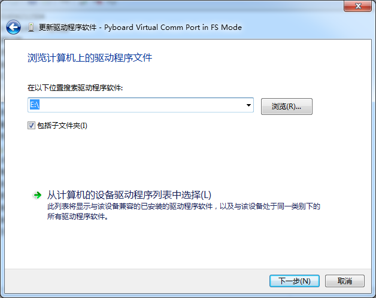

.. _configure:

==========
配置
==========

当第一次使用 PyMagic 时，只要一根 Macro USB 数据线链接到电脑就够了。
当连接了 Macro USB 线后，在 Windows 中会自动安装移动磁盘驱动和虚拟串口驱动。

移动磁盘的驱动系统自带了，可以自动识别出来，而虚拟串口的驱动可以在这个移动磁盘中找到。
在 Linux 和 Mac 下，无需另外安装驱动。

移动磁盘中默认会有4个文件，它们分别是
::

   main.py	// 开机自动运行文件，可以将自己的代码放在里面
   boot.py	// 开机引到文件，由它加载main.py
   pybcdc.inf	// Windows下的虚拟串口驱动文件
   README.txt	// 简要说明

Windows
==========

1、使用 USB 连接到 PyMagic

2、

.. image:: images/pymagic-01.png
    :alt: PYB v1.0 pinout

.. image:: images/pymagic-02.png
    :alt: PYB v1.0 pinout
    :width: 700px

.. image:: images/pymagic-03.png
    :alt: PYB v1.0 pinout
    :width: 700px

.. image:: images/pymagic-05.png
    :alt: PYB v1.0 pinout
    :width: 700px

.. image:: images/pymagic-06.png
    :alt: PYB v1.0 pinout
    :width: 700px

.. image:: images/pymagic-07.png
    :alt: PYB v1.0 pinout
    :width: 700px

.. image:: images/pymagic-08.png
    :alt: PYB v1.0 pinout
    :width: 700px

.. image:: images/pymagic-09.png
    :alt: PYB v1.0 pinout
    :width: 700px

.. image:: images/pymagic-10.png
    :alt: PYB v1.0 pinout
    :width: 700px

.. image:: images/pymagic-11.png
    :alt: PYB v1.0 pinout
    :width: 700px

Linux
==========

打开终端并运行
::

   sudo screen /dev/ttyACM0
   或
   sudo picocom /dev/ttyACM0
   (注视具体情况而定，可能为/dev/ttyACM*)

   
