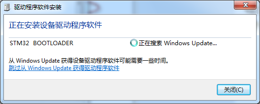
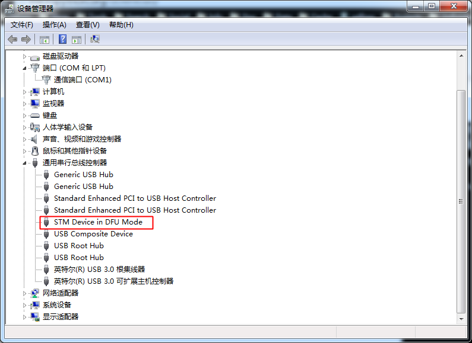
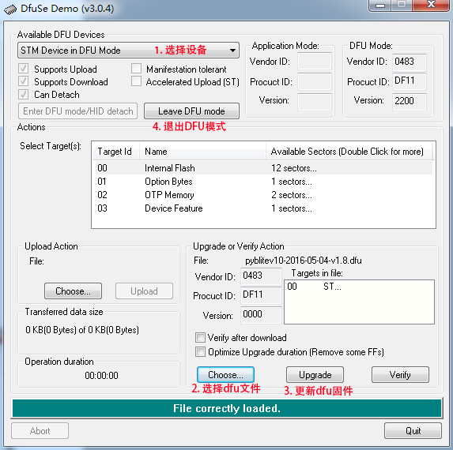

.. _flash-dfu:

===============================
更新 DFU (刚入手请不要轻易尝试)
===============================

下载
==========

下载并安装 `DfuSe Demo`_ 下载 `MicroPython DFU`_ 选择 **Suitable for PYBv1.0 boards** 版本

安装驱动
==========

连接 USB 以 Macro USB 为上，同时按住左上和右上两颗键，系统将自动搜索按住 DFU 驱动，并进入 DFU 模式。

刷入 DFU
==========

安装完 DfuSe Demo 后，打开 DfuSe Demo

1. 选择设备
2. 选择dfu文件
3. 更新dfu固件
4. 退出DFU模式

.. _MicroPython DFU: http://micropython.org/download/
.. _DfuSe Demo: http://www.st.com/st-web-ui/static/active/en/st_prod_software_internet/resource/technical/software/demo_and_example/stsw-stm32080.zip
